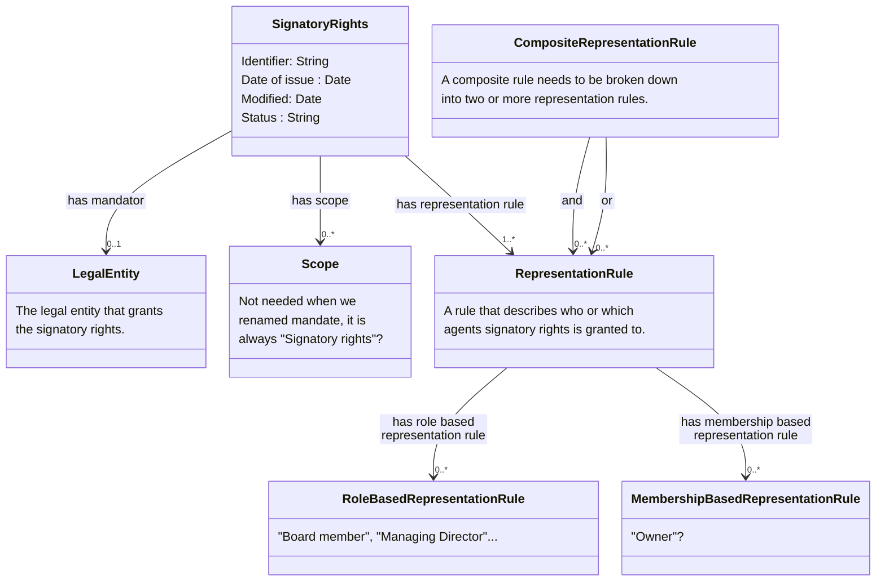

# Nordic-Signatory-Rights-Model

# Note that this page is under construction !!

## Below text is going to be rewritten !! 
Information about signatory rights is mainly registered in two different ways in various nations' business registers.

1)	General provisions about signatory rights are registered either as free-text string or as textual code values, that specify terms for who can representent a legal entity. This is often only available in the national language. 
2)	If signature rights have been assigned to named persons, these are registered with role types indicating that they have signature rights on the legal entity they represent.

A legal entity with multiple signatory rights can be registered with both variants. There are also examples of signatory rights consisting of both text and roles.

Unstructured information and different registration methods create challenges when information about signatory rights is to be exchanged and interpreted across national borders and systems. 

This document proposes a generic approach for how to exchange signatory rights as structured and machine-readable rules within the EU. The Signatory rights model has been developed by the [Nordic Smart Government and Business program](https://nordicsmartgovernment.org/) and is a subset of the [Nordic Smart Government data model](https://tietomallit.suomi.fi/en/model/ncbv?ver=0.0.1). The signatory right descriptions (instances of the model) can be used to validate that certain agents (persons or other legal entities) have the authority to take legally binding decisions on behalf of some legal entity.

The Signatory rights class is defined as criterion for one or more mandates that gives power to an agent to represent a legal entity. A legal entity can be registered with one or more instances of Signatory rights. 

Signatory rights can consist of one or more signatory rules. Each rule describes in a structured machine-readable way the conditions for a mandate to be valid by setting requirements for the number of agents (Person or Legal entity) and the position(s) (Post) they must hold in a legal entity. An agent can hold one or many positions in a legal entity and can acquire signatory rights through multiple signatory rules.

The Signatory rights model is based on the [Core Criterion and Core Evidence Vocabulary](https://semiceu.github.io/CCCEV/releases/2.00/) defining Signatory rights and Signatory rule as subclasses of respectively Criterion and Constraint. The model is also related to [Core Vocabulary of Powers and Mandates](https://github.com/everis-rpam/RPaM-Ontology/wiki/Conceptual-Model-v1.1), which could be used to further define the type of the mandate. However, the Signatory rights model focuses on defining machine readable rules for determining if an Agent or group of Agents have signatory power.

## Class Signatory Rights 

| **Class**          | Signatory Rights |
|---------------------|---------|
| **English name**    | Signatory Rights |
| **Description**     | The terms under which a mandator grants or delegates authority or power to a mandatee. |
| **URI**             | https://iri.suomi.fi/model/nsig/mandate |
| **Requirement Level** | Mandatory |

### Signatory Rights attributes

| **Attribute**          | Date of issue |
|---------------------|---------|
| **English name**    | Date of Issue |
| **Description**     | The date when the mandate (signatory rights) was issued.                                                                                                                             |
| **URI**             | https://iri.suomi.fi/model/nsig/dateOfIssue |
| **Range** | xsd:date |
| **Multiplicity** | 0..1 |
| **Requirement Level** | Recommended |

| **Attribute**          | Identifier |
|---------------------|---------|
| **English name**    | Identifier |
| **Description**     | Unique identifier for the mandate (signatory rights).                                                                                                                                |
| **URI**             | https://iri.suomi.fi/model/nsig/identifierAt |
| **Range** | xsd:string |
| **Multiplicity** | 1..1 |
| **Requirement Level** | Mandatory |

| **Attribute**          | Modified |
|---------------------|---------|
| **English name**    | Modified |
| **Description**     | The date of the last update of the mandate (signatory rights).                                                                                                                       |
| **URI**             | https://iri.suomi.fi/model/nsig/modified |
| **Range** | xsd:date |
| **Multiplicity** | 0..1 |
| **Requirement Level** | Recommended |

| **Attribute**          | Status |
|---------------------|---------|
| **English name**    | Status |
| **Description**     | This property is used to specify the status of the mandate (signatory rights) in the context of maturity lifecycle. Example: Completed, Withdrawn, Deprecated, Under development. |
| **URI**             | https://iri.suomi.fi/model/nsig/status |
| **Range** | xsd:string |
| **Multiplicity** | 0..1 |
| **Requirement Level** | Optional |
| **Note** | The value MUST be selected from the EU's controlled vocabulary Distribution status https://publications.europa.eu/resource/authority/distribution-status|

### Signatory Rights associations

| **Association**          | Has Scope |
|---------------------|---------|
| **English name**    | Has Scope |
| **Description**     | A reference to the specific type of the mandate, in this case Signatory rights.                                                                                                      |
| **URI**             | https://iri.suomi.fi/model/nsig/hasScope |
| **Range** | ncbv:Scope |
| **Multiplicity** | 1..1 |
| **Requirement Level** | Mandatory |

| **Association**          | Has Representation Rule |
|---------------------|---------|
| **English name**    | Has Representation Rule |
| **Description**     | A reference to the representation rule for the signatory rights. A rule that describes who or which agents sigantory rights is granted to                                                         |
| **URI**             | https://iri.suomi.fi/model/nsig/hasRepresentationRule |
| **Range** | ncbv:RepresentationRule |
| **Multiplicity** | 1..* |
| **Requirement Level** | Mandatory |

| **Association**          | Has Mandator |
|---------------------|---------|
| **English name**    | Has Mandator |
| **Description**     | A reference to the mandator (in this case a legal entity) of the mandate.                                                                                                             |  
| **URI**             | https://iri.suomi.fi/model/nsig/hasMandator |
| **Range** | ncbv:Agent |
| **Multiplicity** | 0..1 |
| **Requirement Level** | Optional |
| **Note** | The property hasMandator has an or-relationship with the property grantsMandate. At least one of the properties must occur. |

## Class Scope 

| **Class**          | Scope |
|---------------------|---------|
| **English name**    | Scope |
| **Description**     | A class to define what powers the Mandator grants to the Mandatee through the Mandate (in this case signatory rights). |
| **URI**             | https://iri.suomi.fi/model/nsig/scope |
| **Requirement Level** | Mandatory |

## Class Legal entity

| **Class**          | Legal Entity |
|---------------------|---------|
| **English name**    | Legal Entity |
| **Description**     | A formal organization that is involved in economic activity. |
| **URI**             | https://iri.suomi.fi/model/nsig/legalEntity |
| **Requirement Level** | Mandatory |

## Class Representation Rule

| **Class**          | Representation Rule |
|---------------------|---------|
| **English name**    | Representation Rule |
| **Description**     | Rule that defines which agent(s) can act on behalf of another agent due to the fact that they have signatory power |
| **URI**             | https://iri.suomi.fi/model/nsig/representationRule |
| **Requirement Level** | Mandatory |

## Role Based Class Representation Rule

| **Class**          | Role Based Representation Rule |
|---------------------|---------|
| **English name**    | Representation Rule |
| **Description**     | A role based representation rule indicates which agent(s) have a role that give them signatory power and the power to represent another agent. |
| **URI**             | https://iri.suomi.fi/model/nsig/roleBasedRepresentationRule |
| **Requirement Level** | Mandatory |

## Class Membership Based Representation Rule

| **Class**          | Membership Based Representation Rule |
|---------------------|---------|
| **English name**    | Representation Rule |
| **Description**     | A membership based representation rule indicates which agent(s) have a membership that give them signatory power and the power to represent another agent. |
| **URI**             | https://iri.suomi.fi/model/nsig/membershipBasedRepresentationRule |
| **Requirement Level** | Mandatory |

## Class Composite Representation Rule

| **Class**          | Composite Representation Rule |
|---------------------|---------|
| **English name**    | Representation Rule |
| **Description**     | A composite representation rule needs to be broken down into two or more representation rules. An example: the composite rule "CEO alone or two board members jointly" is broken down into the representation rule "CEO alone" and the rule "two board members jointly" |
| **URI**             | https://iri.suomi.fi/model/nsig/compositeRepresentationRule |
| **Requirement Level** | Mandatory |

 # Examples

We need a bunch of examples!
