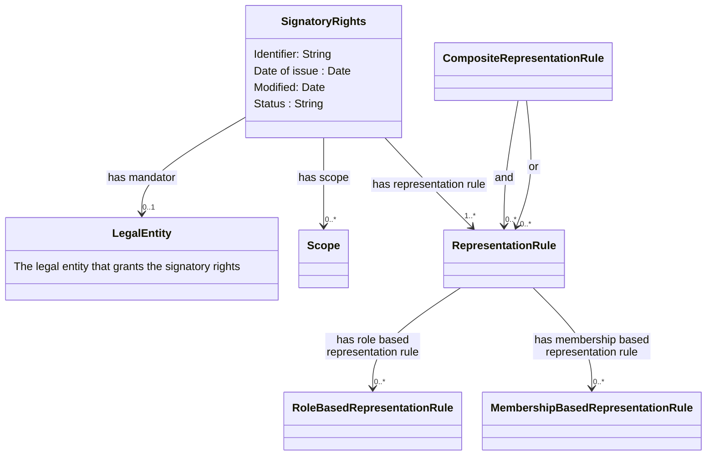

# Nordic-Signatory-Rights-Model

# Note that this page is under construction !!

Information about signatory rights is mainly registered in two different ways in various nations' business registers.

1)	General provisions about signatory rights are registered either as free-text string or as textual code values, that specify terms for who can representent a legal entity. This is often only available in the national language. 
2)	If signature rights have been assigned to named persons, these are registered with role types indicating that they have signature rights on the legal entity they represent.

A legal entity with multiple signatory rights can be registered with both variants. There are also examples of signatory rights consisting of both text and roles.

Unstructured information and different registration methods create challenges when information about signatory rights is to be exchanged and interpreted across national borders and systems. 

This document proposes a generic approach for how to exchange signatory rights as structured and machine-readable rules within the EU. The Signatory rights model has been developed by the [Nordic Smart Government and Business program](https://nordicsmartgovernment.org/) and is a subset of the [Nordic Smart Government data model](https://tietomallit.suomi.fi/en/model/ncbv?ver=0.0.1). The signatory right descriptions (instances of the model) can be used to validate that certain agents (persons or other legal entities) have the authority to take legally binding decisions on behalf of some legal entity.

The Signatory rights class is defined as criterion for one or more mandates that gives power to an agent to represent a legal entity. A legal entity can be registered with one or more instances of Signatory rights. 

Signatory rights can consist of one or more signatory rules. Each rule describes in a structured machine-readable way the conditions for a mandate to be valid by setting requirements for the number of agents (Person or Legal entity) and the position(s) (Post) they must hold in a legal entity. An agent can hold one or many positions in a legal entity and can acquire signatory rights through multiple signatory rules.

The Signatory rights model is based on the [Core Criterion and Core Evidence Vocabulary](https://semiceu.github.io/CCCEV/releases/2.00/) defining Signatory rights and Signatory rule as subclasses of respectively Criterion and Constraint. The model is also related to [Core Vocabulary of Powers and Mandates](https://github.com/everis-rpam/RPaM-Ontology/wiki/Conceptual-Model-v1.1), which could be used to further define the type of the mandate. However, the Signatory rights model focuses on defining machine readable rules for determining if an Agent or group of Agents have signatory power.

## Class Mandate 

| **Class**          | Mandate |
|---------------------|---------|
| **English name**    | Mandate |
| **Description**     | The terms under which a mandator grants or delegates authority or power to a mandatee. |
| **URI**             | [https://iri.suomi.fi/model/ncbv/0.0.3/Mandate](https://iri.suomi.fi/model/ncbv/0.0.3/Mandate) [https://iri.suomi.fi/model/ncbv/Mandate](https://iri.suomi.fi/model/ncbv/Mandate) [https://tietomallit.suomi.fi/en/model/ncbv/class/Mandate?ver=0.0.3](https://tietomallit.suomi.fi/en/model/ncbv/class/Mandate?ver=0.0.3) |
| **Requirement Level** | Mandatory |

### Mandate attributes

| **Attribute**          | Date of issue |
|---------------------|---------|
| **English name**    | Date of Issue |
| **Description**     | The date when the mandate was issued or when the registration of the legal entity was published or amended. |
| **URI**             | (https://iri.suomi.fi/model/ncbv/0.0.3/dateOfIssue https://iri.suomi.fi/model/ncbv/dateOfIssue) |
| **Range** | xsd:date |
| **Multiplicity** | 0..1 |
| **Requirement Level** | Recommended |

| **Attribute**          | Delegable |
|---------------------|---------|
| **English name**    | Delegable |
| **Description**     | Information about if the powers given by the mandate are transferable or not. |
| **URI**             | (https://iri.suomi.fi/model/ncbv/0.0.3/delegable) |
| **Range** | xsd:boolean |
| **Multiplicity** | 0..1 |
| **Requirement Level** | Recommended |

| **Attribute**          | Date of issue |
|---------------------|---------|
| **English name**    | Date of Issue |
| **Description**     | The date when the mandate was issued or when the registration of the legal entity was published or amended. |
| **URI**             | (https://iri.suomi.fi/model/ncbv/0.0.3/dateOfIssue https://iri.suomi.fi/model/ncbv/dateOfIssue) |
| **Range** | xsd:date |
| **Multiplicity** | 0..1 |
| **Requirement Level** | Recommended |

| **Attribute**          | Identifier |
|---------------------|---------|
| **English name**    | Identifier |
| **Description**     | Unique identifier for the mandate. |
| **URI**             | https://iri.suomi.fi/model/ncbv/0.0.3/identifierAt |
| **Range** | xsd:string |
| **Multiplicity** | 1..1 |
| **Requirement Level** | Mandatory |

| **Attribute**          | Modified |
|---------------------|---------|
| **English name**    | Modified |
| **Description**     | The date of the last update of the mandate. |
| **URI**             | https://iri.suomi.fi/model/ncbv/0.0.3/modified |
| **Range** | xsd:date |
| **Multiplicity** | 0..1 |
| **Requirement Level** | Recommended |

| **Attribute**          | Status |
|---------------------|---------|
| **English name**    | Status |
| **Description**     | This property is used to specify the status of the mandate in the context of maturity lifecycle. Example: Completed, Withdrawn, Deprecated, Under development. |
| **URI**             | https://iri.suomi.fi/model/ncbv/0.0.3/status |
| **Range** | xsd:string |
| **Multiplicity** | 0..1 |
| **Requirement Level** | Optional |
| **Note** | The value MUST be selected from the EU's controlled vocabulary Distribution status https://publications.europa.eu/resource/authority/distribution-status|

### Mandate associations

| **Association**          | Geographical Scope |
|---------------------|---------|
| **English name**    | Geographical Scope |
| **Description**     | The association geographical scope points at a location; this describes the geographic region the mandate is valid in. |
| **URI**             | https://iri.suomi.fi/model/ncbv/0.0.3/geographicalScope |
| **Range** | ncbv:Location |
| **Multiplicity** | 0..1 |
| **Requirement Level** | Recommended |

| **Association**          | Has Duration |
|---------------------|---------|
| **English name**    | Has Duration |
| **Description**     | A reference to the duration of the mandate. |
| **URI**             | https://iri.suomi.fi/model/ncbv/0.0.3/hasDuration |
| **Range** | ncbv:PeriodOfTime |
| **Multiplicity** | 0..1 |
| **Requirement Level** | Optional |

| **Association**          | Has Mandate Type |
|---------------------|---------|
| **English name**    | Has Mandate Type |
| **Description**     | A reference to the specific type of the mandate. |
| **URI**             | https://iri.suomi.fi/model/ncbv/0.0.3/isType |
| **Range** | ncbv:MandateType |
| **Multiplicity** | 1..1 |
| **Requirement Level** | Mandatory |

| **Association**          | Has Representation Rule |
|---------------------|---------|
| **English name**    | Has Representation Rule |
| **Description**     | A reference to the representation rule for the mandate. |
| **URI**             | https://iri.suomi.fi/model/ncbv/0.0.3/hasRepresentationRule |
| **Range** | ncbv:RepresentationRule |
| **Multiplicity** | 1..* |
| **Requirement Level** | Mandatory |

| **Association**          | Has Restriction |
|---------------------|---------|
| **English name**    | Has Restriction |
| **Description**     | A reference to a restriction for the mandate. |
| **URI**             | https://iri.suomi.fi/model/ncbv/0.0.3/hasRestriction |
| **Range** | ncbv:Restriction |
| **Multiplicity** | 0..* |
| **Requirement Level** | Optional |

| **Association**          | Has Source |
|---------------------|---------|
| **English name**    | Has Source |
| **Description**     | A reference to the source of the mandate. |
| **URI**             | https://iri.suomi.fi/model/ncbv/0.0.3/hasSource |
| **Range** | ncbv:Source |
| **Multiplicity** | 0..1 |
| **Requirement Level** | Optional |

| **Association**          | Has Scope |
|---------------------|---------|
| **English name**    | Has Scope |
| **Description**     | A reference to the scope of the mandate. |
| **URI**             | https://iri.suomi.fi/model/ncbv/0.0.3/hasScope |
| **Range** | ncbv:Scope |
| **Multiplicity** | 0..* |
| **Requirement Level** | Optional |

| **Association**          | Has Mandator |
|---------------------|---------|
| **English name**    | Has Mandator |
| **Description**     | A reference to the mandator of the mandate. |
| **URI**             | https://iri.suomi.fi/model/ncbv/0.0.3/hasMandator |
| **Range** | ncbv:Agent |
| **Multiplicity** | 0..1 |
| **Requirement Level** | Optional |
| **Note** | The property hasMandator has an or-relationship with the property grantsMandate. At least one of the properties must occur. |

## Legal entity

A self-employed person, company, or organization that has legal rights and obligations.

Class reused from [Core business vocabulary](https://semiceu.github.io/Core-Business-Vocabulary/releases/2.1.0/#Agent).

### Properties

**signatoryRights**: Relation from Legal Entity to Signatory Rights

Note: Also other relevant properties from the Legal Entity.

## Signatory rights

Signatory rights describe criterion for one or more mandates that gives power to an agent to represent a legal entity. Signatory rights can be defined as free text or structured as machine readable signatory rules.

Subclass of [Criterion](https://semiceu.github.io/CCCEV/releases/2.00/#Criterion).

### Properties

**description**: Free text description for the Signatory rights

**signatoryRule**: Relation to structured signatory rule. Each referenced rule can give an agent or group of agents the signatory power (interpreted as OR clause).

## Signatory rule

Structured constraint for one mandate that dictates the combination of posts, roles and agents to whom the power to represent a legal entity is granted. Rules can be used to structure signatory rights that can be granted alone to an individual agent or jointly for group of agents. The rule is interpreted jointly if it points to multiple posts using restriction properties.

Subclass of [Constraint](https://semiceu.github.io/CCCEV/releases/2.00/#Constraint).

Typically signatory rights have been described as freeform text which can be structured using following restrictions:

* Alone
* Jointly
  * All of
  * Majority of
  * One of
  * Two of
  * Three of
  * Four of
  * Five of

The model defines these restrictions as properties to be used by the Signatory Rules to constraint number of agents needed from Posts to have a signatory power to a Legal Entity.

*Notes:*

*The instance of signatory rule is interpreted jointly (AND clause) if it points to many Posts using multiple restriction properties.*

### Properties

* **constraint** (abstract) defines constraint for a spesific post

  * **alone** requires exactly one of the agents holding a post to sign.

  * **jointly** (abstract) requires the agents holding a post to sign jointly according to the rules
  
    * **allOf** requires all of the agents holding a post to sign.

    * **majorityOf** requires majority of agents holding a post to sign.

    * **numberOf** (abstract) requires defined number of agents holding a post to sign from a larger group of agents.
      * **oneOf**
      * **twoOf**
      * **threeOf**
      * **fourOf**
      * **fiveOf**

*Notes on constraints:*

1. *The Alone constraint should always require exactly one Post (0..1) and should not be combined with other restriction properties within one signatory rule. In case of defining jointly restriction with singular requirement one should list of oneOf restriction instead. See [example](https://github.com/nordicsmartgovernment/Nordic-Smart-Government-Datamodel-Examples/blob/main/Examples/NO-signatory-rights-example.json)*

2. *The need for numeric constraint was only up to 5 in all of Nordic countries. If requirement arises to model arbitrary numeric constraints this could be done using qualified relations, for example numberOf property and a blank node (or custom class) using rdf:value instead of creating explicit properties.*

## Post

A Post represents some position within an organization that exists independently of the agent or agents filling it. A post can be held by multiple persons or legal entities. 

There can be multiple Posts using the same Role for different responsibilities and signatory rights. For example if Signatory right is given to external personnel, one agent may have signatory rights alone and other agents with the same role can have signatory rights jointly.

The Post concept is reused from the [W3C Organization ontology](https://www.w3.org/TR/vocab-org/#class-post).

### Properties

**role** Points to a role for the Post

**heldBy** Points to agents holding the Post

Note: Could have identifier and description if needed

## Agent

Entity that is able to carry out actions.

Class reused from FOAF / [Core business vocabulary](https://semiceu.github.io/Core-Business-Vocabulary/releases/2.1.0/#Agent).

### Properties

All properties required to define the agent

## Role

Denotes a role that a Person or other Agent can take in an organization. 

Class reused from [W3C Organization ontology](https://www.w3.org/TR/vocab-org/#class-role).

### Properties

**preferredLabel** Label for the role
**notation** Identifier for the code in text form
**inScheme** Reference to the classification

 # Examples

See [Examples](https://github.com/nordicsmartgovernment/Nordic-Smart-Government-Datamodel-Examples/tree/main/Examples) folder for JSON and JSON-LD examples. OpenAPI examples can also be seen in the [NSG&B API documentation](https://nordicsmartgovernment.github.io/Nordic-Smart-Government-OpenAPI-Specifications/v2.html#tag/nordicinformation/operation/signatoryRights).
