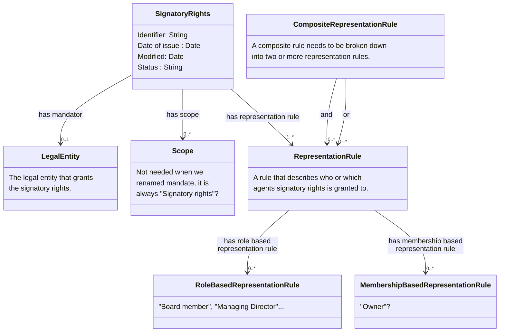

# Nordic-Signatory-Rights-Model

# Note that this page is under construction !!

## Below text is going to be rewritten !! 
Information about signatory rights is mainly registered in two different ways in various nations' business registers.

1)	General provisions about signatory rights are registered either as free-text string or as textual code values, that specify terms for who can representent a legal entity. This is often only available in the national language. 
2)	If signature rights have been assigned to named persons, these are registered with role types indicating that they have signature rights on the legal entity they represent.

A legal entity with multiple signatory rights can be registered with both variants. There are also examples of signatory rights consisting of both text and roles.

Unstructured information and different registration methods create challenges when information about signatory rights is to be exchanged and interpreted across national borders and systems. 

This document proposes a generic approach for how to exchange signatory rights as structured and machine-readable rules within the EU. The Signatory rights model has been developed by the [Nordic Smart Government and Business program](https://nordicsmartgovernment.org/) and is a subset of the [Nordic Smart Government data model](https://tietomallit.suomi.fi/en/model/ncbv?ver=0.0.1). The signatory right descriptions (instances of the model) can be used to validate that certain agents (persons or other legal entities) have the authority to take legally binding decisions on behalf of some legal entity.

The Signatory rights class is defined as criterion for one or more mandates that gives power to an agent to represent a legal entity. A legal entity can be registered with one or more instances of Signatory rights. 

Signatory rights can consist of one or more signatory rules. Each rule describes in a structured machine-readable way the conditions for a mandate to be valid by setting requirements for the number of agents (Person or Legal entity) and the position(s) (Post) they must hold in a legal entity. An agent can hold one or many positions in a legal entity and can acquire signatory rights through multiple signatory rules.

The Signatory rights model is based on the [Core Criterion and Core Evidence Vocabulary](https://semiceu.github.io/CCCEV/releases/2.00/) defining Signatory rights and Signatory rule as subclasses of respectively Criterion and Constraint. The model is also related to [Core Vocabulary of Powers and Mandates](https://github.com/everis-rpam/RPaM-Ontology/wiki/Conceptual-Model-v1.1), which could be used to further define the type of the mandate. However, the Signatory rights model focuses on defining machine readable rules for determining if an Agent or group of Agents have signatory power.

## Class Signatory Rights 

| **Class**          | Signatory Rights |
|---------------------|---------|
| **Name**    | Signatory Rights |
| **Description**     | The terms under which a mandator grants or delegates authority or power to a mandatee. |
| **URI**             | https://iri.suomi.fi/model/nsig/mandate |
| **Requirement Level** | Mandatory |

### Attributes of the Signatory Rights class 

| **Attribute**          | Date of issue |
|---------------------|---------|
| **Name**    | Date of Issue |
| **Description**     | The date when the mandate (signatory rights) was issued.                                                                                                                             |
| **URI**             | https://iri.suomi.fi/model/nsig/dateOfIssue |
| **Range** | xsd:date |
| **Multiplicity** | 0..1 |
| **Requirement Level** | Recommended |

| **Attribute**          | Identifier |
|---------------------|---------|
| **Name**    | Identifier |
| **Description**     | Unique identifier for the mandate (signatory rights).                                                                                                                               |
| **URI**             | https://iri.suomi.fi/model/nsig/identifierAt |
| **Range** | xsd:string |
| **Multiplicity** | 1..1 |
| **Requirement Level** | Mandatory |

| **Attribute**          | Modified |
|---------------------|---------|
| **Name**    | Modified |
| **Description**     | The date of the last update of the mandate (signatory rights).                                                                                                                       |
| **URI**             | https://iri.suomi.fi/model/nsig/modified |
| **Range** | xsd:date |
| **Multiplicity** | 0..1 |
| **Requirement Level** | Recommended |

| **Attribute**          | Status |
|---------------------|---------|
| **Name**    | Status |
| **Description**     | This property is used to specify the status of the mandate (signatory rights) in the context of maturity lifecycle. Example: Completed, Withdrawn, Deprecated, Under development. |
| **URI**             | https://iri.suomi.fi/model/nsig/status |
| **Range** | xsd:string |
| **Multiplicity** | 0..1 |
| **Requirement Level** | Optional |
| **Note** | The value MUST be selected from the EU's controlled vocabulary Distribution status https://publications.europa.eu/resource/authority/distribution-status|

### Associations of the Signatory Rights class

| **Association**          | Has Scope |
|---------------------|---------|
| **Name**    | Has Scope |
| **Description**     | A reference to the specific type of the mandate, in this case Signatory rights.                                                                                                      |
| **URI**             | https://iri.suomi.fi/model/nsig/hasScope |
| **Range** | ncbv:Scope |
| **Multiplicity** | 1..1 |
| **Requirement Level** | Mandatory |

| **Association**          | Has Representation Rule |
|---------------------|---------|
| **Name**    | Has Representation Rule |
| **Description**     | A reference to the representation rule for the signatory rights. A rule that describes who or which agents sigantory rights is granted to                                                         |
| **URI**             | https://iri.suomi.fi/model/nsig/hasRepresentationRule |
| **Range** | ncbv:RepresentationRule |
| **Multiplicity** | 1..* |
| **Requirement Level** | Mandatory |

| **Association**          | Has Mandator |
|---------------------|---------|
| **Name**    | Has Mandator |
| **Description**     | A reference to the mandator (in this case a legal entity) of the mandate.                                                                                                             |  
| **URI**             | https://iri.suomi.fi/model/nsig/hasMandator |
| **Range** | ncbv:Agent |
| **Multiplicity** | 0..1 |
| **Requirement Level** | Optional |
| **Note** | The property hasMandator has an or-relationship with the property grantsMandate. At least one of the properties must occur. |

## Class Scope 

| **Class**          | Scope |
|---------------------|---------|
| **Name**    | Scope |
| **Description**     | A class to define what powers the Mandator grants to the Mandatee through the Mandate (in this case signatory rights). |
| **URI**             | https://iri.suomi.fi/model/nsig/scope |
| **Requirement Level** | Mandatory |

## Class Legal entity

| **Class**          | Legal Entity |
|---------------------|---------|
| **Name**    | Legal Entity |
| **Description**     | A formal organization that is involved in economic activity. |
| **URI**             | https://iri.suomi.fi/model/nsig/legalEntity |
| **Requirement Level** | Mandatory |

## Class Representation Rule

| **Name**          | Representation Rule |
|---------------------|---------|
| **English name**    | Representation Rule |
| **Description**     | A rule that describes to whom the signatory rights are granted.|
| **URI**             | https://iri.suomi.fi/model/nsig/representationRule |
| **Requirement Level** | Mandatory |
| **Note** | At least one representation rule, expressed either as an instance of this class or of one of its subclasses, must always be provided. Use of the more specific subclasses is recommended whenever the rule can be represented in a structured form. |
| **Usage note** | Use this class when a representation rule is available only in written or unstructured form and cannot be expressed using structured data. Where the rule can be broken down into structured components, one or more of the specific subclasses should be used instead. |

### Attributes of the Representation Rule class 
| **Attribute**          | Description |
|---------------------|---------|
| **Name**    | Description |
| **Description**     | A textual representation of the rule in a human-readable form.                                                                                                                             |
| **URI**             | https://iri.suomi.fi/model/nsig/description |
| **Range** | xsd:string |
| **Multiplicity** | 0..1 |
| **Requirement Level** | Recommended |
| **Usage note** | Use to provide the rule in text when structured representation is not possible, or together with structured data to convey the rule in a human-readable form. |

| **Attribute**          | Sequence |
|---------------------|---------|
| **Name**    | Sequence |
| **Description**     | Indicates the position of a representation rule within a composite representation rule, defining the order in which the rules are applied or evaluated. |                                                                                                      |
| **URI**             | https://iri.suomi.fi/model/nsig/sequence |
| **Range** | xsd:string |
| **Multiplicity** | 0..1 |
| **Requirement Level** | Recommended |

## Class Role Based Representation Rule

| **Class**          | Role Based Representation Rule |
|---------------------|---------|
| **Name**    | Representation Rule |
| **Description**     | A rule that specifies representation based on organizational roles and the number of role holders required to act. |
| **URI**             | https://iri.suomi.fi/model/nsig/RoleBasedRepresentationRule |
| **Requirement Level** | Recommended |
| **Usage note** | Use this class when a representation rule can be expressed in terms of organizational roles and the number of individuals holding those roles who must act. For example, when two board members must sign jointly, or when the CEO can act alone. If a representation rule consists of a combination of roles, this must be expressed as separate role-based representation rules within a composite representation rule. |

### Attributes of the Role Based Representation Rule class

| **Attribute**          | Minimum Number of Memberships |
|---------------------|---------|
| **Name**    | Minimum Number of Memberships |
| **Description**     | The minimum number of membership required for the rule to be valid. |                                                                                                      |
| **URI**             | https://iri.suomi.fi/model/nsig/minimumNumberOfMemberships |
| **Range** | xsd:string |
| **Multiplicity** | 0..1 |
| **Requirement Level** | Recommended |

## Class Membership Based Representation Rule

| **Class**          | Membership Based Representation Rule |
|---------------------|---------|
| **Name**    | Representation Rule |
| **Description**     | A rule that specifies representation based on being a member of the mandating legal entity, and the number of such members required to act. |
| **URI**             | https://iri.suomi.fi/model/nsig/MembershipBasedRepresentationRule |
| **Requirement Level** | Recommended|
| **Usage note** | Use this class when a representation rule can be expressed in terms of members of the mandating legal entity and the number of such members required to act. For example, when two members of a partnership must act jointly, or when three members of an association can sign together. If a representation rule consists of a combination of membership-based rules, these must be expressed as separate membership-based representation rules within a composite representation rule. |

## Class Composite Representation Rule

| **Class**          | Composite Representation Rule |
|---------------------|---------|
| **Name**    | Representation Rule |
| **Description**     | A rule consisting of one or more representation rules, each of which may be role-based, membership-based, or composite. |
| **URI**             | https://iri.suomi.fi/model/nsig/compositeRepresentationRule |
| **Requirement Level** | Recommended |

### Associations of the Representation Rule class 

| **Association**          | And |
|---------------------|---------|
| **Name**    | And |
| **Description**     | A cumulative logical connection between two or more rules (equivalent to logical AND operator). |                                                                                                      |
| **URI**             | https://iri.suomi.fi/model/nsig/and |
| **Range** | ncbv:RepresentationRule |
| **Multiplicity** | 0..1 |
| **Requirement Level** | Recommended |

| **Association**          | Or |
|---------------------|---------|
| **Name**    | Or |
| **Description**     | An alternative logical connection between two or more rules (equivalent to logical OR operator). |                                                                                                      |
| **URI**             | https://iri.suomi.fi/model/nsig/or |
| **Range** | ncbv:RepresentationRule |
| **Multiplicity** | 0..1 |
| **Requirement Level** | Recommended |

# References

## Nordic Core Business Vocabulary
The Nordic core business vocabulary, defined in collaboration by the Nordic countries.

Link to Tietomallit
Link to RDF
Link to JSON-LD

## Nordic Signatory Rights
Application profile for signatory rights, defined in collaboration by the Nordic countries.

Link to Tietomallit
Link to RDF
Link to JSON-LD

# Examples

We need a bunch of examples!
