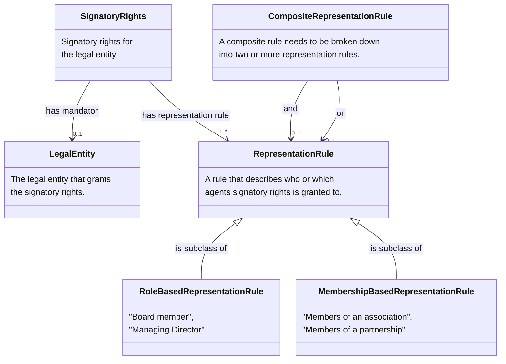

# Nordic-Signatory-Rights-Model

# Note that this page is under construction !!

This document proposes a generic approach for how to exchange signatory rights as structured and machine-readable rules within the EU. The Signatory rights model work started in [Nordic Smart Government and Business program](https://nordicsmartgovernment.org/) and has been continued in Nordic Smart Government Network, Data Quality and Sematic Group. The model is based on the [Nordic Core Business Vocabulary](https://tietomallit.suomi.fi/en/model/ncbv?ver=0.0.5). 

Information about signatory rights is mainly registered in two different ways in various nations' business registers.

1)	General provisions about signatory rights are registered either as free-text string or as textual code values, that specify terms for who can representent a legal entity. This is often only available in the national language. 
2)	If signature rights have been assigned to named persons, these are registered indicating that they have signature rights on the legal entity they represent.

A legal entity with multiple signatory rights can be registered with both variants. There are also examples of signatory rights consisting of both free text and more structured data.

Unstructured information and different registration methods create challenges when information about signatory rights is to be exchanged and interpreted across national borders and systems. 

A legal entity can be registered with one or more instances of Signatory rights.

Signatory rights can consist of one or more representation rules. Each rule describes in a structured machine-readable way the conditions for a mandate to be valid by setting requirements for the number of agents (Person or Legal entity) and the roles they must hold in a legal entity. An agent can hold one or many roles in a legal entity and can acquire signatory rights through multiple signatory rules.

## Overview model

## Complete model

### Nordic Signatory Rights
Application profile for signatory rights, defined in collaboration by the Nordic countries.

[Link to NSIG model](https://iri.suomi.fi/model/ncig/) Needs to be published before it works!

Link to RDF

Link to JSON-LD

### Nordic Core Business Vocabulary
The Nordic core business vocabulary, defined in collaboration by the Nordic countries.

[Link to NCBV model](https://iri.suomi.fi/model/ncbv/)

Link to RDF

Link to JSON-LD

# Examples
Turtle
JSON-LD
JSON-schema

# Classes, attributes and associations

## Class Signatory Rights 

| **Class**          | Signatory Rights |
|---------------------|---------|
| **Name**    | Signatory Rights |
| **Description**     | Signatory rights are a mandate that grants a mandatee the authority to sign documents or make legally binding commitments on behalf of the mandator. |
| **URI**             | https://iri.suomi.fi/model/ncbv/Mandate |
| **Requirement Level** | Mandatory |

### Attributes of the Signatory Rights class 

| **Attribute**          | Date of issue |
|---------------------|---------|
| **Name**    | Date of Issue |
| **Description**     | The date when the signatory rights was issued.                                                                                                                             |
| **URI**             | https://iri.suomi.fi/model/ncbv/dateOfIssue |
| **Range** | xsd:date |
| **Multiplicity** | 0..1 |
| **Requirement Level** | Recommended |

| **Attribute**          | Identifier |
|---------------------|---------|
| **Name**    | Identifier |
| **Description**     | Unique identifier for the signatory rights.                                                                                                                               |
| **URI**             | https://iri.suomi.fi/model/ncbv/identifierValue |
| **Range** | xsd:string |
| **Multiplicity** | 1..1 |
| **Requirement Level** | Mandatory |

| **Attribute**          | Modified |
|---------------------|---------|
| **Name**    | Modified |
| **Description**     | The date of the last update of the signatory rights.                                                                                                                       |
| **URI**             | https://iri.suomi.fi/model/ncbv/modified |
| **Range** | xsd:date |
| **Multiplicity** | 0..1 |
| **Requirement Level** | Recommended |

| **Attribute**          | Status |
|---------------------|---------|
| **Name**    | Status |
| **Description**     | This property is used to specify the status of the mandate (signatory rights) in the context of maturity lifecycle.|
| **URI**             | https://iri.suomi.fi/model/ncbv/status |
| **Range** | skos:Concept |
| **Multiplicity** | 0..1 |
| **Requirement Level** | Recommended |
| **Note** | The value MUST be selected from the EU's controlled vocabulary Distribution status https://publications.europa.eu/resource/authority/distribution-status|

### Associations of the Signatory Rights class

| **Association**          | Has Representation Rule |
|---------------------|---------|
| **Name**    | Has Representation Rule |
| **Description**     | A reference to the representation rule for the signatory rights. |
| **URI**             | https://iri.suomi.fi/model/ncbv/hasRepresentationRule |
| **Range** | ncbv:RepresentationRule |
| **Multiplicity** | 1..* |
| **Requirement Level** | Mandatory |

| **Association**          | Has Mandator |
|---------------------|---------|
| **Name**    | Has Mandator |
| **Description**     | Reference to the legal entity acting as mandator of the signatory rights. |  
| **URI**             | https://iri.suomi.fi/model/ncbv/hasMandator |
| **Range** | ncbv:LegalEntity |
| **Multiplicity** | 0..1 |
| **Requirement Level** | Optional |
| **Note** | The property hasMandator has an or-relationship with the property grantsMandate. At least one of the properties must occur. |

## Class Agent

| **Class**          | Agent |
|---------------------|---------|
| **Name**    | Agent |
| **Description**     | An entity involved in signatory rights as mandator or mandatee. |
| **URI**             | https://iri.suomi.fi/model/ncbv/Agent |
| **Requirement Level** | Mandatory |
| **Note** | This is an abstract class. Therefore only the subclasses ncbv:LegalEntity and ncvb:Person SHOULD be used in a data exhange. |

## Class Legal Entity

| **Class**          | Legal Entity |
|---------------------|---------|
| **Name**    | Legal Entity |
| **Description**     | A formal organization participating in signatory rights, in the role of either mandator or mandatee. |
| **URI**             | https://iri.suomi.fi/model/ncbv/legalEntity |
| **Subclass of**             | ncbv:Agent |
| **Requirement Level** | Mandatory |

### Attributes of the Legal Entity class

| **Attribute**          | Legal Name |
|---------------------|---------|
| **Name**    | Legal Name |
| **Description**     | A name under which the legal entity is registered. |
| **URI**             | https://iri.suomi.fi/model/ncbv/legalName |
| **Range** | xsd:string |
| **Multiplicity** | 1..1 |
| **Requirement Level** | Recommended |

### Associations of the Legal Entity class

| **Association**          | Identifier |
|---------------------|---------|
| **Name**    | Identifier |
| **Description**     | A reference to the identifier of a legal entity. |
| **URI**             | https://iri.suomi.fi/model/ncbv/hasIdentifier |
| **Range** | xsd:string |
| **Multiplicity** | 1..* |
| **Requirement Level** | Mandatory 

| **Association**          | Grants Signatory Rights |
|---------------------|---------|
| **Name**    | Grants Signatory Rights |
| **Description**     | A reference to the signatory rights granted by the legal entity, acting as the mandator. |
| **URI**             | https://iri.suomi.fi/model/ncbv/grantsMandate |
| **Range** | ncbv:Mandate |
| **Multiplicity** | 1..* |
| **Requirement Level** | Mandatory | 

| **Association**          | Has Member |
|---------------------|---------|
| **Name**    | Has Member |
| **Description**     | A reference to a membership associating a mandatee with the legal entity regarding signatory rights. |
| **URI**             | https://iri.suomi.fi/model/ncbv/hasMember |
| **Range** | ncbv:Membership |
| **Multiplicity** | 1..* |
| **Requirement Level** | Mandatory | 

## Class Person

| **Class**          | Person |
|---------------------|---------|
| **Name**    | Person |
| **Description**     |  An individual human being acting as mandatee under signatory rights. |
| **URI**             | https://iri.suomi.fi/model/ncbv/Person |
| **Subclass of** | ncbv:Agent |
| **Requirement Level** | Recommended |

### Attributes of the Person class

| **Attribute**          | Date of Birth |
|---------------------|---------|
| **Name**    | Date of Birth |
| **Description**     | A point in time on which a person was born. |
| **URI**             | https://iri.suomi.fi/model/ncbv/dateOfBirth |
| **Range** | xsd:date |
| **Multiplicity** | 1..1 |
| **Requirement Level** | Mandatory |

| **Attribute**          | Full Name |
|---------------------|---------|
| **Name**    | Full Name |
| **Description**     | The complete name of the Person as one string. |
| **URI**             | https://iri.suomi.fi/model/ncbv/fullName |
| **Range** | xsd:string |
| **Multiplicity** | 1..1 |
| **Requirement Level** | Mandatory |

### Associations of the Person class

| **Association**          | Identifier |
|---------------------|---------|
| **Name**    | Identifier |
| **Description**     | A reference to the identifier of a person. |
| **URI**             | https://iri.suomi.fi/model/ncbv/hasIdentifier |
| **Range** | xsd:string |
| **Multiplicity** | 1..* |
| **Requirement Level** | Mandatory |

## Class Identifier
| **Class**          | Identifier |
|---------------------|---------|
| **Name**    | Identifier |
| **Description**     |  A structured reference that identifies an agent. |
| **URI**             | https://iri.suomi.fi/model/ncbv/Identifier |
| **Requirement Level** | Mandatory |

### Attributes of the Identifier Class

| **Attribute**          | Date of Issue |
|---------------------|---------|
| **Name**    | Date of Issue |
| **Description**     |  The date on which the Identifier was assigned. |                                                                                                                        |
| **URI**             | https://iri.suomi.fi/model/ncbv/dateOfIssue |
| **Range** | xsd:date |
| **Multiplicity** | 0..1 |
| **Requirement Level** | Recommended |

| **Attribute**          | Notation |
|---------------------|---------|
| **Name**    | Notation |
| **Description**     | 	A string of characters to uniquely identify a concept. |                                                                                                                     |
| **URI**             | https://iri.suomi.fi/model/ncbv/notation |
| **Range** | xsd:string |
| **Multiplicity** | 1..1 |
| **Requirement Level** | Mandatory |

| **Attribute**          | Schema Agency |
|---------------------|---------|
| **Name**    |  Schema Agency |
| **Description**     | The name of the agency that issued the identifier. |                                                                                                                      |
| **URI**             | https://iri.suomi.fi/model/ncbv/schemaAgency |
| **Range** | xsd:string |
| **Multiplicity** | 0..1 |
| **Requirement Level** | Recommended |

| **Attribute**          | Schema Name |
|---------------------|---------|
| **Name**    |  Schema Name |
| **Description**     | Name of the scheme used to construct the identifier. |                                                                                                                        |
| **URI**             | https://iri.suomi.fi/model/ncbv/schemaName |
| **Range** | xsd:string |
| **Multiplicity** | 0..1 |
| **Requirement Level** | Recommended |

| **Attribute**          | Schema URI |
|---------------------|---------|
| **Name**    |  Schema Agency |
| **Description**     | URI of the scheme used to construct the identifier. |                                                                                                                       |
| **URI**             | https://iri.suomi.fi/model/ncbv/schemaAgency |
| **Range** | xsd:string |
| **Multiplicity** | 0..1 |
| **Requirement Level** | Recommended |

## Class Membership

| **Class**          | Membership |
|---------------------|---------|
| **Name**    | Membership |
| **Description**     | Indicates the nature of an agent's membership of an legal entity. |
| **URI**             | https://iri.suomi.fi/model/ncbv/Membership |
| **Requirement Level** | Recommended | 

### Associations of the Membership  class

| **Association**          | Member |
|---------------------|---------|
| **Name**    | Member |
| **Description**     | Indicates the Agent involved in the Membership relationship. |
| **URI**             | https://iri.suomi.fi/model/ncbv/member |
| **Range** | ncvb:Membership |
| **Multiplicity** |1..1|
| **Requirement Level** | Mandatory |

| **Association**          | Role |
|---------------------|---------|
| **Name**    | Role |
| **Description**     | Indicates the role that the agent plays in a membership relationship with an legal entity. |
| **URI**             | https://iri.suomi.fi/model/ncbv/role |
| **Range** | ncvb:Role |
| **Multiplicity** |0..1|
| **Requirement Level** | Recommended |

## Class Representation Rule

| **Name**          | Representation Rule |
|---------------------|---------|
| **English name**    | Representation Rule |
| **Description**     | A rule that describes to whom the signatory rights are granted.|
| **URI**             | https://iri.suomi.fi/model/ncbv/representationRule |
| **Requirement Level** | Mandatory |
| **Note** | At least one representation rule, expressed either as an instance of this class or of one of its subclasses, must always be provided. Use of the more specific subclasses is recommended whenever the rule can be represented in a structured form. |
| **Usage note** | Use this class when a representation rule is available only in written or unstructured form and cannot be expressed using structured data. Where the rule can be broken down into structured components, one or more of the specific subclasses should be used instead. |

### Attributes of the Representation Rule class 
| **Attribute**          | Description |
|---------------------|---------|
| **Name**    | Description |
| **Description**     | A textual representation of the rule in a human-readable form.|
| **URI**             | https://iri.suomi.fi/model/ncbv/description |
| **Range** | xsd:string |
| **Multiplicity** | 0..1 |
| **Requirement Level** | Recommended |
| **Usage note** | Use to provide the rule in text when structured representation is not possible, or together with structured data to convey the rule in a human-readable form. |

| **Attribute**          | Sequence |
|---------------------|---------|
| **Name**    | Sequence |
| **Description**     | Indicates the position of a representation rule within a composite representation rule, defining the order in which the rules are applied or evaluated. |                                                                                                      |
| **URI**             | https://iri.suomi.fi/model/ncbv/sequence |
| **Range** | xsd:string |
| **Multiplicity** | 0..1 |
| **Requirement Level** | Recommended |

## Class Role Based Representation Rule

| **Class**          | Role Based Representation Rule |
|---------------------|---------|
| **Name**    | Representation Rule |
| **Description**     | A rule that specifies representation based on organizational roles and the number of role holders required to act. |
| **URI**             | https://iri.suomi.fi/model/ncbv/RoleBasedRepresentationRule |
| **Requirement Level** | Recommended |
| **Subclass Of**           | ncvb:RepresentationRule |
| **Usage note** | Use this class when a representation rule can be expressed in terms of organizational roles and the number of role-holders required to act. For example, when two board members must sign jointly, or when the CEO can act alone. If a representation rule consists of a combination of roles, this must be expressed as separate role-based representation rules within a composite representation rule. |

### Attributes of the Role Based Representation Rule class

| **Attribute**          | Minimum Number of Role holders |
|---------------------|---------|
| **Name**    | Minimum Number of Role holders |
| **Description**     | Specifies the minimum number of individuals holding the specified role that must act for the representation rule to be valid. |                                                                                                      |
| **URI**             | https://iri.suomi.fi/model/ncbv/minimumNumberOfRoleHolders |
| **Range** | xsd:positiveInteger |
| **Multiplicity** | 0..1 |
| **Requirement Level** | Recommended |
| **Usage note** | Use this property to indicate the minimum number of individuals holding the specified role (role holders) who must act for the representation rule to be valid. When the rule is part of a composite representation rule, this minimum applies to the specific role-based rule within the composite. Either this property or Role Holder Quantifier property SHOULD be used, but not both. |

### Associations of the Role Based Representation Rule class

| **Association**          | Role Holder Quantifier |
|---------------------|---------|
| **Name**    | Role holder Quantifier |
| **Description**     | Specifies a qualitative quantity or proportion of role holders required for the rule, used when the number cannot be expressed as a specific numeric value (e.g., “all”, “half”, “majority”). |                                                                                                      |
| **URI**             | https://iri.suomi.fi/model/ncbv/roleHolderQuantifier |
| **Range** | skos:Concept |
| **Multiplicity** | 0..1 |
| **Requirement Level** | Recommended |
| **Usage note** | Use this property when a role-based representation rule requires a non-numeric quantification of role holders. Either this property or Minimum Number Of Role Holders property SHOULD be used, but not both. |

| **Association**          | Defines Valid Role |
|---------------------|---------|
| **Name**    | Defines Valid Role |
| **Description**     | Specifies the organizational role that an individual must hold for the role-based representation rule to be valid. |                                                                                                      |
| **URI**             | https://iri.suomi.fi/model/ncbv/definesValidRole |
| **Range** | ncbv:Role |
| **Multiplicity** | 1..* |
| **Requirement Level** | Mandatory |
| **Usage note** | Use this property to indicate which role or roles qualify an individual to act under the rule. The rule is considered satisfied only if the required number of individuals holding the specified role(s) participate. Typically, only a single role is referenced. However, in cases where the rule refers to a general role (e.g., “board member”), it may be necessary to specify more precise roles. For example, the rule “Two board members jointly” may require that, in addition to the general board member role, more specific roles such as board chair and board vice-chair are specified. |

## Class Membership Based Representation Rule

| **Class**          | Membership Based Representation Rule |
|---------------------|---------|
| **Name**    | Representation Rule |
| **Description**     | A rule that specifies representation based on being a member of the mandating legal entity, and the number of such members required to act. |
| **URI**             | https://iri.suomi.fi/model/ncbv/MembershipBasedRepresentationRule |
| **Subclass Of**           | ncvb:RepresentationRule |
| **Requirement Level** | Recommended |
| **Usage note** | Use this class when a representation rule can be expressed in terms of members of the mandating legal entity and the number of such members required to act. For example, when two members of a partnership must act jointly, or when three members of an association can sign together. If a representation rule consists of a combination of membership-based rules, these must be expressed as separate membership-based representation rules within a composite representation rule. |

### Attributes of the Membership Based Representation Rule class

| **Attribute**          | Minimum Number of Members |
|---------------------|---------|
| **Name**    | Minimum Number of Members |
| **Description**     | Specifies the minimum number of members of the legal entity who hold the specified signatory rights (mandatees) that must act for the role-based representation rule to be valid. |                                                                 
| **URI**             | https://iri.suomi.fi/model/ncbv/minimumNumberOfMembers |
| **Range** | xsd:positiveInteger |
| **Multiplicity** | 0..1 |
| **Requirement Level** | Recommended |
| **Usage note** | Use this property to indicate the minimum number of mandatees (holders of the specific signatory rights) within the legal entity who are required to act for the rule to be valid. When the rule is part of a composite representation rule, this minimum applies to the specific membership-based rule within the composite. Either this property or the Member Quantifier property SHOULD be used, but not both.|

### Associations of the Membership Based Representation Rule class

| **Association**          | Member Quantifier |
|---------------------|---------|
| **Name**    | Member Quantifier |
| **Description**     | Specifies a qualitative quantity or proportion of members of the mandating legal entity required for the rule, used when the number cannot be expressed as a specific numeric value (e.g., “all”, “half”, “majority”). |                            
| **URI** | https://iri.suomi.fi/model/ncbv/memberQuantifier |
| **Range** | skos:Cocept |
| **Multiplicity** | 0..1 |
| **Requirement Level** | Recommended |
| **Usage note** | Use this property when a membership-based representation rule requires a non-numeric quantification of members. This property complements MinimumNumberOfMembers and may be used in combination with numeric values if appropriate. Either this property or the Minimum Number of Members property SHOULD be used, but not both|

| **Association**          | Defines Valid Membership |
|---------------------|---------|
| **Name**    | Defines Valid Role |
| **Description**     | Specifies the memberships that qualify individuals to act under the membership-based representation rule. |                                                                                   
| **URI**             | https://iri.suomi.fi/model/ncbv/definesValidMembership |
| **Range** | ncbv:Membership |
| **Multiplicity** | 1 .. *|
| **Requirement Level** | Mandatory |
| **Usage note** |Use this property to indicate which members of the legal entity are authorized to act. The rule is considered satisfied only if the required number of these members participate. |

## Class Composite Representation Rule

| **Class**          | Composite Representation Rule |
|---------------------|---------|
| **Name**    | Representation Rule |
| **Description**     | A rule consisting of one or more representation rules, each of which may be role-based, membership-based, or composite. |
| **URI**             | https://iri.suomi.fi/model/ncbv/CompositeRepresentationRule |
| **Subclass Of**     | ncvb:RepresentationRule |
| **Requirement Level** | Recommended |

### Associations of the Representation Rule class 

| **Association**          | And |
|---------------------|---------|
| **Name**    | And |
| **Description**     | A cumulative logical connection between two or more rules (equivalent to logical AND operator). |                                                                                                      |
| **URI**             | https://iri.suomi.fi/model/ncbv/and |
| **Range** | ncbv:RepresentationRule |
| **Multiplicity** | 0..1 |
| **Requirement Level** | Recommended |

| **Association**          | Or |
|---------------------|---------|
| **Name**    | Or |
| **Description**     | An alternative logical connection between two or more rules (equivalent to logical OR operator). |                                                                                                      |
| **URI**             | https://iri.suomi.fi/model/ncbv/or |
| **Range** | ncbv:RepresentationRule |
| **Multiplicity** | 0..1 |
| **Requirement Level** | Recommended |

## Class Membership

| **Class**          | Membership |
|---------------------|---------|
| **Name**    | Membership |
| **Description**     | A membership represents a relationship between an agent and an organization or legal entity, indicating the agent’s role, participation, or affiliation within that entity. |
| **URI**             | https://iri.suomi.fi/model/ncbv/Membership |
| **Requirement Level** | Recommended |

### Attributes of the Membership class

| **Attribute**          | Name |
|---------------------|---------|
| **Name**    | Identifier |
| **Description**     | A structured reference that identifies an agent. |                                                                 
| **URI**             | https://iri.suomi.fi/model/ncbv/identifierValue |
| **Range** | xsd:string |
| **Multiplicity** | 0..1 |
| **Requirement Level** | Recommended |

### Associations of the Membership class 

| **Association**          | Member |
|---------------------|---------|
| **Name**    | Member |
| **Description**     | Indicates the agent involved in the membership relationship to the legal entity. |                                                                 
| **URI**             | https://iri.suomi.fi/model/ncbv/Member |
| **Range** | ncvb:Agent |
| **Multiplicity** | 1..1 |
| **Requirement Level** | Mandatory |

| **Association**          | Role |
|---------------------|---------|
| **Name**    | Role |
| **Description**     | Indicates the role that an agent plays in a membership relationship to the legal entity. |                                                                 
| **URI**             | https://iri.suomi.fi/model/ncbv/Role |
| **Range** | ncvb:Role |
| **Multiplicity** | 0..1 |
| **Requirement Level** | Mandatory |
| **Usage note** |Use this property to specify the organizational role associated with the membership. It is mandatory when the membership is part of a Role Based Representation Rule. |

## Class Role

| **Class**          | Role |
|---------------------|---------|
| **Name**    | Role |
| **Description**     | The Role that the Agent plays in a Membership relationship with a legal entity. |
| **URI**             | https://iri.suomi.fi/model/ncbv/Role |
| **Subclass Of**           | skos:Concept |
| **Requirement Level** | Recommended |

## Used namespaces ##

| Prefix       | Namespace | Name |
|---------------------|---------|-----------------|
| **ncbv**    | https://iri.suomi.fi/model/ncbv/  |      |
| **skos**     |     http://www.w3.org/2004/02/skos/core#    |  	SKOS Simple Knowledge Organization System |
| **xsd**   | http://www.w3.org/2001/XMLSchema# | XML Schema Part 2: Datatypes Second Edition |
